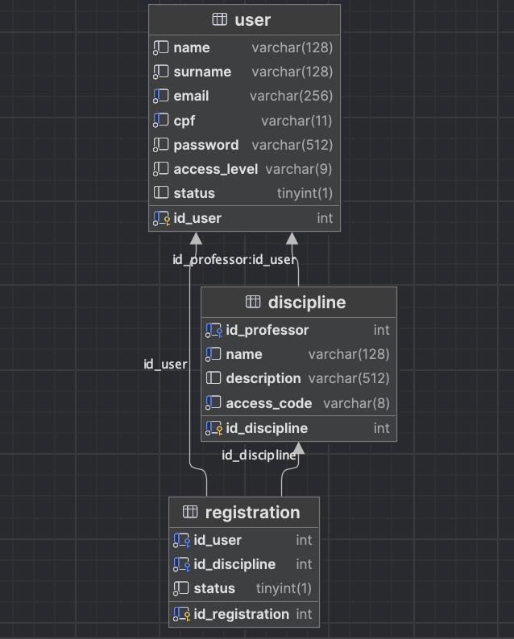

# Documentação do Projeto JavaFX - Sistema de Gestão Acadêmica EnsinAE

## Introdução
Este documento fornece uma visão geral e detalhes sobre o projeto JavaFX desenvolvido para um sistema de gestão acadêmica, semelhante ao Google Classroom. O projeto utiliza JavaFX para a interface gráfica, e o banco de dados
MySQL com um modelo relacional composto por três tabelas: User, Discipline e Registration.

### Objetivo
O objetivo principal do sistema é gerenciar usuários (studant, professor, ADM), disciplinas e registros de participação nas disciplinas.

## Estrutura do Banco de Dados

### Tabelas
1. **User**
    - Armazena informações sobre os usuários do sistema.
    - Campos: id_user (chave primária), name, surname, email, cpf, password, access_level (tipo de usuário), status (status de ativação).

2. **Discipline**
    - Contém dados sobre as disciplinas cadastradas no sistema.
    - Campos: id_discipline (chave primária), id_professor (chave estrangeira) ,name, description, access_code(código de acesso para a disciplina).

3. **Registration**
    - Registra a associação entre estudantes e disciplinas.
    - Campos: id_registration (chave primária), id_user(chave estrangeira, id do "estudante"), id_discipline (chave estrangeira).

## Tipos de Usuários

### 1. studant
- Pode se cadastrar no sistema, aguardando aprovação de um ADM.
- Realizar cadastro em disciplinas, sujeito à aprovação do professor.
- Alterar informações pessoais.
- Acessar páginas das disciplinas nas quais foram aceitos.

### 2. professor
- Todos os privilégios de um studant.
- Criar disciplinas vinculadas ao seu ID.
- Remover alunos das disciplinas sob sua responsabilidade.

### 3. ADM
- Todos os privilégios de um professor.
- Criar novos professores no sistema.
- Autenticar usuários recentemente cadastrados e ainda não verificados.

## Funcionalidades por Tipo de Usuário

### studant
- **Cadastro em Disciplinas**
    - Requisição de cadastro em disciplinas.
    - Aguarda aprovação do professor responsável.

- **Alteração de Informações Pessoais**
    - Edição de informações próprias no perfil.

- **Acesso às Disciplinas**
    - Acesso às páginas das disciplinas nas quais foram aceitos.

### professor
- **Cadastro de Disciplinas**
    - Criação de novas disciplinas vinculadas ao seu ID.

- **Remoção de Alunos**
    - Remoção de alunos das disciplinas sob sua responsabilidade.

### ADM
- **Cadastro de Professores**
    - Inserção de novos professores no sistema.

- **Autenticação de Usuários**
    - Verificação e autenticação de usuários recentemente cadastrados.

## Fluxo de Autenticação e Cadastro

1. **Cadastro de studant**
    - O cadastro é solicitado.
    - Aguarda aprovação de um ADM.
    - Após aprovação, a conta é ativada.

2. **Cadastro de professor**
    - Apenas ADM pode cadastrar professores.
    - Professores têm acesso total após cadastro.

3. **Cadastro de ADM**
    - ADMs são diretamente inseridos no banco de dados.
    - Não há meio de cadastrar ADMs através da aplicação.

## Conclusão
Este documento fornece uma visão abrangente das 
funcionalidades do sistema JavaFX - EnsinAE, esclarecendo as diferentes ações que cada 
tipo de usuário pode realizar. Certifique-se de seguir as diretrizes de segurança e 
controle de acesso ao implementar e manter este sistema.

# Imagens do Sistema
- ## Página de Login
    
- ## Página de Cadastro de Estudante
    
- ## Página Inicial
    
- ## Página de Modificação das Informações do Usuário
    
- ## Página de Cadastro de Professor
    
- ## Página de Registro de Disciplina
    
- ## Página de Matricula em disciplina
    
- ## Página de Autorização de novos usuários
    
 - ## Página da Disciplina
    
